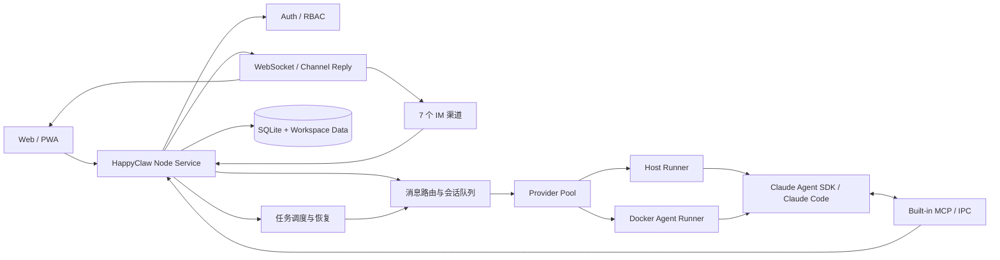

<p align="center">
  <a href="https://happyclaw.cc/">
    
  </a>
</p>

<h1 align="center">HappyClaw</h1>

<p align="center">
  <strong>自托管、多用户、Agent-first 的 Claude Code 工作台</strong>
  <br />
  让 Claude Code 通过 Web 与 7 种消息渠道长期在线，在宿主机或 Docker 沙箱中安全执行任务。
</p>

<p align="center">
  <a href="https://happyclaw.cc/"></a>
  <a href="https://github.com/riba2534/happyclaw/actions/workflows/ci.yml"></a>
  <a href="https://nodejs.org/"></a>
  
  <a href="https://github.com/riba2534/happyclaw"></a>
  <a href="LICENSE"></a>
</p>

<p align="center">
  <a href="#happyclaw-是什么">介绍</a> ·
  <a href="#功能总览">功能</a> ·
  <a href="#快速开始">快速开始</a> ·
  <a href="#渠道接入">渠道</a> ·
  <a href="#系统架构">架构</a> ·
  <a href="#开发与测试">开发</a> ·
  <a href="#贡献">贡献</a>
</p>

<p align="center">
  <a href="https://happyclaw.cc/"><strong>访问官网</strong></a> ·
  <a href="docs/API.md">API 文档</a> ·
  <a href="docs/ACL-MATRIX.md">权限矩阵</a> ·
  <a href="https://github.com/riba2534/happyclaw/issues">问题反馈</a>
</p>

---

## HappyClaw 是什么

HappyClaw 是一个基于 [Claude Agent SDK for TypeScript](https://github.com/anthropics/claude-agent-sdk-typescript) 的自托管 AI Agent 系统。它把完整的 Claude Code 运行时封装成一个可持续运行的多用户服务，让你可以从浏览器、飞书、Telegram、QQ、钉钉、微信、Discord 或 WhatsApp 使用同一套 Agent、工作区、能力和自动化任务。

HappyClaw 不是一个简单的聊天 API Wrapper。Agent 运行在真实的 Claude Code 环境中，可以读写项目文件、执行终端命令、使用浏览器、调用 MCP、加载 Skills，并在多个独立工作区和会话之间保持清晰的权限与上下文边界。

### 为什么使用 HappyClaw

- **Claude Code 原生运行时** — 直接使用版本锁定的 Claude Agent SDK 与 Claude Code CLI，不重新实现工具调用和 Agent 循环。
- **Agent-first 工作台** — Agent 管身份和能力，工作区管文件与执行环境，会话管对话上下文，产品层级清晰。
- **随时可访问** — Web、PWA 和 7 种 IM 渠道统一接入，任务完成后可以主动把结果送回消息渠道。
- **多用户与多账号** — 用户、渠道凭据、工作区、记忆、Skills、MCP 和运行数据彼此隔离。
- **宿主机与容器双模式** — 管理员可以使用授权的本机项目目录，普通成员默认在 Docker 沙箱中运行。
- **面向长期运行** — 提供调度任务、运行历史、消息回执、故障恢复、用量统计、监控与一致性备份。

## 功能总览

| 模块           | 主要能力                                                                               |
| -------------- | -------------------------------------------------------------------------------------- |
| **Agent**      | 主 HappyClaw Agent、自定义 Agent、头像、结构化提示词、AI 生成/优化、版本历史与恢复     |
| **工作区**     | Agent 归属、宿主机/容器执行、独立目录、项目环境变量、项目 Claude 上下文、多会话        |
| **能力治理**   | 用户 Skills、系统/用户 MCP、Claude Code Plugins、工具策略、只读/受限模式、最终生效预览 |
| **消息渠道**   | 飞书、Telegram、QQ、钉钉、微信、Discord、WhatsApp，多账号、扫码登录、工作区/会话绑定   |
| **模型提供商** | Anthropic 官方与第三方兼容端点、多 Provider、轮询/加权/故障转移、健康检查、会话粘性    |
| **定时任务**   | Cron、固定间隔、一次性任务，Agent/Script 执行，隔离上下文，幂等立即运行，通知重试      |
| **记忆与文件** | 用户全局记忆、工作区记忆、日期记忆、上下文压缩归档、全文搜索、文件上传下载与终端       |
| **用量与计费** | Token 分类统计、Agent/工作区/模型筛选、明细与 CSV 导出、订阅、余额、兑换码与配额       |
| **运维与安全** | RBAC、邀请注册、登录设备、审计日志、运行监控、Docker 镜像管理、备份与安全恢复          |
| **客户端体验** | 实时流式输出、工具轨迹、Markdown/Mermaid/KaTeX、消息分享图片、响应式布局与 PWA         |

## Agent-first 工作模型

HappyClaw 使用统一的 `Agent → Workspace → Runtime Session` 层级：

```text
Agent（身份、提示词、Skills、MCP、工具策略）
└── Workspace（项目目录、执行模式、环境变量、渠道挂载）
    ├── Main Session（工作区主会话）
    ├── Runtime Session（独立对话或渠道原生话题）
    └── Scheduled Run（定时任务的普通或隔离运行）
```

- **Agent** 保存长期身份和能力策略。主 HappyClaw Agent 始终存在，也可以创建代码审查、研究、运维等自定义 Agent。
- **Workspace** 是私有的文件与执行隔离边界。创建时必须选择 Agent，后续可以迁移归属。
- **Runtime Session** 是工作区内的一段独立对话上下文，不是另一个顶层 Agent。
- **Channel Mount** 把 IM 群聊、私聊或原生话题挂载到工作区或具体会话。

### 执行模式

| 模式          | 适用对象                   | 行为                                                      |
| ------------- | -------------------------- | --------------------------------------------------------- |
| **Host**      | 管理员授权的宿主机工作区   | 直接在指定本机目录运行，适合已有代码仓库和本机工具链      |
| **Container** | 普通成员与需要隔离的工作区 | 在非 root Docker 容器中运行，使用独立工作目录和预装工具链 |

普通成员不能把容器工作区降级为宿主机执行。Script 定时任务也只允许管理员在有权限的 Host 工作区运行。

## Agent 与能力治理

### Agent Profile

每个自定义 Agent 都可以配置：

- 名称、头像和 Claude 原生 preset。
- 身份、目标、工作方式和输出要求等结构化提示词。
- AI 生成提示词、局部优化、版本记录和历史版本恢复。
- 托管 Claude 上下文或管理员宿主机 Claude 上下文。
- 用户 Skills、HappyClaw MCP、Claude Code Plugins 和工具权限策略。
- `full`、`restricted`、`readonly` 等能力边界。

配置页可以针对具体工作区预览最终生效能力，包括项目 `CLAUDE.md`、`.claude/skills`、项目 MCP、用户能力和同名覆盖来源。

### Skills、MCP 与 Plugins

HappyClaw 区分不同层级的能力来源：

| 来源                    | 说明                                                              |
| ----------------------- | ----------------------------------------------------------------- |
| **内置能力**            | 随 HappyClaw 或 Agent 容器提供的基础工具与 Skills                 |
| **用户 Skills**         | 从技能市场、HTTPS Git 仓库或 ZIP 导入，按用户隔离并记录来源与版本 |
| **项目上下文**          | 工作区目录里的 `CLAUDE.md`、`.claude/skills` 和 MCP 配置          |
| **用户 MCP**            | 当前用户维护的 MCP Server，只进入允许使用它的 Agent               |
| **系统 MCP**            | 管理员维护，默认仅管理员可用，显式共享后普通成员才能使用          |
| **Claude Code Plugins** | 系统 catalog 与用户启用状态分离，通过版本化运行快照加载           |

内置 MCP 工具覆盖消息发送、定时任务、渠道查询、Skill 管理和记忆读写；实际开放的工具会根据用户权限、Agent 策略、工作区模式和渠道上下文动态裁剪。

## 渠道接入

每个用户都可以创建多个渠道账号，为账号设置默认工作区，再按群聊、私聊或话题覆盖绑定目标。

| 渠道         | 接入方式                          | 主要能力                                              |
| ------------ | --------------------------------- | ----------------------------------------------------- |
| **飞书**     | App ID / App Secret，WebSocket    | 流式卡片、图片与文件、Reaction、群聊 @ 控制、话题映射 |
| **Telegram** | Bot Token，Long Polling           | Markdown/HTML、长消息分片、图片与文件、代理配置       |
| **QQ**       | App ID / App Secret，WebSocket    | 私聊、群聊 @Bot、图片消息、配对码绑定                 |
| **钉钉**     | Client ID / Client Secret，Stream | AI Card 流式回复、图片与文件、群聊 @ 控制             |
| **微信**     | Web 界面扫码，iLink               | 二维码授权、媒体收发、Typing、断线恢复                |
| **Discord**  | Bot Token，Gateway                | 私聊与服务器频道路由、多账号隔离、频道信息查询        |
| **WhatsApp** | Web 界面扫码，Baileys             | 二维码登录、文本与媒体、会话持久化、断线恢复          |
| **Web**      | 浏览器与 WebSocket                | 实时 Markdown、文件、终端、工具轨迹、PWA              |

渠道账号的凭据和扫码会话按用户、账号隔离。绑定支持以下层级：

1. 渠道账号的默认 Agent/工作区。
2. 指定群聊或私聊绑定到工作区主会话。
3. 指定群聊或话题绑定到工作区内的独立会话。
4. 飞书话题群等原生线程自动映射为独立运行会话。

在支持斜杠命令的渠道中，可以使用 `/list`、`/status`、`/where`、`/bind`、`/unbind`、`/new` 和 `/clear` 管理当前上下文。写操作受工作区 owner 和渠道发言者策略约束。

## 模型与提供商

HappyClaw 可以同时配置多个 Claude Provider，并为新会话按策略选择健康的 Provider。

| 类型               | 配置方式                                                               |
| ------------------ | ---------------------------------------------------------------------- |
| **Anthropic 官方** | Claude OAuth、一键登录、`setup-token` / `.credentials.json` 或 API Key |
| **第三方兼容端点** | 填写 API Endpoint、Auth Token 和模型名称，可启用 1M 上下文             |

第三方 Provider 会自动预填 Claude Code 兼容环境变量，包括主模型映射、上下文窗口、自动压缩、超时和非必要流量设置。高级设置会展示所有预填值，用户可以编辑、恢复默认值或增加自定义 Header 等环境变量。

负载均衡支持：

- **Round Robin** — 在健康 Provider 之间轮询。
- **Weighted Round Robin** — 按权重分配新会话。
- **Failover** — 优先使用主 Provider，故障时切换。
- **健康恢复** — 连续失败后暂时摘除，经过恢复窗口重新探测。
- **会话粘性** — 已开始的会话保持 Provider 一致，避免上下文在模型之间漂移。

## 定时任务

定时任务使用与交互会话相同的 Agent、工作区和执行策略：

- **调度方式** — Cron、固定间隔和一次性时间点；间隔任务最短 60 秒。
- **执行类型** — Agent 任务运行完整 Claude Agent；Script 任务直接执行 Shell。
- **上下文模式** — `group` 注入工作区主会话；`isolated` 每次创建独立队列、Claude session 和 IPC 命名空间。
- **立即运行** — Web、REST 和 MCP 共用幂等键与稳定 `runId`，网络重试不会重复执行。
- **运行控制** — 支持暂停、恢复、编辑、停止当前运行、软删除和恢复任务。
- **持久化历史** — 记录执行状态、耗时、结果、尝试次数、通知状态和错误。
- **通知重试** — 执行结果和通知状态分离；通知失败只重试通知，不会重新执行任务。
- **异常恢复** — 服务重启后通过持久化运行记录和租约识别、恢复或终止遗留任务。

REST 接口和状态字段见 [API 文档](docs/API.md#任务)。

## 快速开始

### 环境要求

- macOS 或 Linux；Windows 推荐使用 WSL2。
- [Node.js](https://nodejs.org/) 20 或更高版本，推荐使用 CI 同款 Node.js 22。
- npm 与 GNU Make。
- [Docker](https://www.docker.com/)：普通成员和 Container 工作区需要；仅使用管理员 Host 工作区时可不安装。

macOS 可以使用 [OrbStack](https://orbstack.dev/) 或 Docker Desktop，Linux 可以使用 Docker Engine。

> Claude Code CLI 不需要单独安装。项目依赖中已经包含与 Claude Agent SDK 配套、版本锁定的 Claude Code 运行时。

### 安装并启动

```bash
git clone https://github.com/riba2534/happyclaw.git
cd happyclaw
make start
```

首次启动会自动安装三端依赖、编译后端/Web/Agent Runner，并在 Docker 可用时构建 Agent 镜像。启动完成后打开：

<http://localhost:3000>

首次访问按照向导完成：

1. 创建第一个管理员账户。
2. 配置 Anthropic 官方账号或第三方 Claude 兼容 Provider。
3. 可选添加飞书、Telegram、QQ、钉钉、微信、Discord 或 WhatsApp 渠道账号。
4. 进入工作台创建 Agent、工作区和会话。

### 开发模式

```bash
make dev
```

开发模式同时启动后端和 Vite 前端：

- Web 前端：<http://localhost:5173>
- API / WebSocket：<http://localhost:3000>

### 常用运行命令

| 命令                                            | 说明                                           |
| ----------------------------------------------- | ---------------------------------------------- |
| `make start`                                    | 构建必要产物并以前台生产模式启动               |
| `WEB_PORT=8080 make start`                      | 使用自定义端口启动                             |
| `make status`                                   | 查看端口、健康状态、日志文件和 Docker 容器     |
| `make stop`                                     | 停止当前端口上的 HappyClaw 服务                |
| `make install-host-tools`                       | 安装 Host 模式的可选工具与刷新内置 Skills 缓存 |
| `make backup`                                   | 创建一致性运行数据备份                         |
| `make restore FILE=happyclaw-backup-xxx.tar.gz` | 停止服务后恢复指定备份                         |
| `make help`                                     | 查看完整命令列表                               |

## 配置与数据

HappyClaw 优先通过 Web 设置管理配置，不要求用户维护一组庞大的环境变量。

### Web 设置入口

| 页面                    | 内容                                                  |
| ----------------------- | ----------------------------------------------------- |
| **设置 → 模型与提供商** | 官方/第三方 Provider、密钥、模型、1M 上下文和负载均衡 |
| **设置 → 消息渠道**     | 渠道账号、扫码登录、连接状态、默认工作区和会话绑定    |
| **设置 → 主 HappyClaw** | 默认 Agent 的 Skills、MCP 与工具策略                  |
| **设置 → 执行与容量**   | 超时、并发、上下文窗口和运行限制                      |
| **设置 → 任务与自动化** | 定时任务默认值和自动化策略                            |
| **设置 → 宿主机集成**   | 管理员 Host 目录与 Claude 上下文来源                  |
| **设置 → 注册策略**     | 开放注册、邀请码注册或关闭注册                        |
| **设置 → 用户与访问**   | 用户、权限、邀请码与审计日志                          |

### 可选环境变量

| 变量                            | 默认值                   | 说明                            |
| ------------------------------- | ------------------------ | ------------------------------- |
| `WEB_PORT`                      | `3000`                   | Web、REST API 与 WebSocket 端口 |
| `WEB_SESSION_SECRET`            | 自动生成并持久化         | Web 登录会话签名密钥            |
| `CONTAINER_IMAGE`               | `happyclaw-agent:latest` | Agent 容器镜像                  |
| `CONTAINER_TIMEOUT`             | `1800000`                | 容器硬超时，毫秒                |
| `IDLE_TIMEOUT`                  | `1800000`                | 容器空闲保活时间，毫秒          |
| `MAX_CONCURRENT_CONTAINERS`     | `20`                     | 最大并发容器数                  |
| `MAX_CONCURRENT_HOST_PROCESSES` | `5`                      | 最大并发宿主机 Agent 进程数     |
| `MAX_FILE_SIZE_MB`              | `50`                     | Web 和 IM 入站文件大小上限      |
| `TRUST_PROXY`                   | `false`                  | 位于可信反向代理后时设为 `true` |
| `TZ`                            | 系统时区                 | 日志与定时任务时区              |

Provider 与渠道凭据建议只在 Web 设置中填写。它们使用 AES-256-GCM 加密存储，相关 API 只返回是否已配置，不返回密钥明文。

### 运行数据

所有持久化运行数据默认位于 `data/`：

```text
data/
├── db/messages.db     # SQLite 主数据库
├── config/            # 加密配置、密钥与系统设置
├── groups/            # 工作区目录、项目文件和工作区记忆
├── memory/            # 日期记忆
├── sessions/          # Claude 会话持久化数据
├── skills/            # 用户 Skills
└── plugins/           # Plugin catalog、用户状态与运行快照
```

不要把 `data/` 提交到 Git。迁移实例时优先使用 `make backup` 和 `make restore`；恢复流程会检查归档路径、文件类型、符号链接、清单和数据库完整性。

## 系统架构



主服务始终使用 Node.js 运行，负责认证、路由、队列、调度、渠道连接、Provider 池、用量和持久化。Docker 只用于隔离 Agent 执行环境，不承载 HappyClaw 主服务。

### 技术栈

| 层                | 技术                                                                             |
| ----------------- | -------------------------------------------------------------------------------- |
| **主服务**        | Node.js、TypeScript、Hono、WebSocket、SQLite                                     |
| **Agent Runtime** | Claude Agent SDK、Claude Code CLI、MCP、文件 IPC                                 |
| **Web**           | React 19、Vite、Tailwind CSS、Radix UI、Zustand、Recharts、xterm.js              |
| **渠道**          | Feishu SDK、grammY、QQ Bot API、DingTalk Stream、Discord.js、Baileys、微信 iLink |
| **隔离执行**      | Docker、非 root Node.js 容器、Chromium、常用开发与浏览器工具                     |
| **质量保障**      | TypeScript、Vitest、Prettier、GitHub Actions                                     |

## 安全模型

HappyClaw 会执行代码和访问第三方消息平台，部署前请理解以下边界：

- 用户、渠道账号、工作区、记忆、Skills、MCP、Plugin 状态和用量记录按 owner 隔离。
- Provider 与渠道密钥使用本机 AES-256-GCM 密钥加密，密钥文件权限限制为 `0600`。
- REST、WebSocket、IM 命令和 MCP 工具分别执行身份、owner、角色与能力策略检查。
- 普通成员固定使用 Container 模式；管理员 Host 模式只允许访问授权目录。
- `readonly` / `restricted` Agent 会关闭危险工具、用户 MCP/Plugin 和写入能力。
- Script 定时任务只允许管理员在授权的 Host 工作区执行。
- Skill ZIP、文件上传、备份恢复和 Git 操作包含路径、符号链接、大小与目标校验。
- 对公网开放时，建议使用 HTTPS 反向代理、强密码、关闭开放注册，并定期备份 `data/`。

完整接口权限见 [ACL 权限矩阵](docs/ACL-MATRIX.md)。

## 开发与测试

### 常用命令

```bash
make install          # 安装主服务、Web 与 Agent Runner 依赖
make dev              # 启动开发环境
make typecheck        # 三端类型检查 + 共享类型/Prompt 引用校验
make test             # 运行 Vitest 测试
make format-check     # 检查本次改动涉及文件的格式
make build            # 构建后端、Web 与 Agent Runner
npm run self-test     # 构建 + Agent Runner 自检 + 全量测试
```

项目只使用 Node.js/npm 工具链，不使用 Bun。主服务依赖 Node.js 的 HTTP Upgrade 与 `ws` 完成 WebSocket 握手。

### 项目结构

```text
happyclaw/
├── src/                         # 主服务、路由、调度、渠道、权限与持久化
├── web/                         # React Web/PWA
├── container/
│   └── agent-runner/            # Host/Container 共用的 Agent 执行器
├── shared/                      # 主服务与前端/Runner 共享的事件类型源
├── scripts/                     # 构建、校验、备份和恢复脚本
├── tests/                       # 后端、前端契约、迁移与安全回归测试
├── docs/                        # API、权限与设计文档
├── Makefile                     # 统一开发、构建和运维入口
└── data/                        # 本地运行数据，不进入 Git
```

### CI 合并门槛

每个 Pull Request 都会执行：

1. 三端 `npm ci` 可复现安装。
2. 改动文件格式检查。
3. 共享事件类型一致性检查。
4. 后端、Web 和 Agent Runner 类型检查。
5. 全量 Vitest 测试。
6. 三端生产构建。
7. Agent Runner 自检。

## 文档

| 文档                                                              | 用途                                              |
| ----------------------------------------------------------------- | ------------------------------------------------- |
| [Web API](docs/API.md)                                            | REST API、认证、任务、渠道账号、Agent、用量等接口 |
| [ACL 权限矩阵](docs/ACL-MATRIX.md)                                | HTTP、WebSocket 与 IM 命令的权限要求              |
| [Agent-first 架构方案](docs/agent-first-architecture-plan.md)     | Agent、工作区、运行会话与渠道挂载的设计背景       |
| [Plugin 自动化设计](docs/claude-code-plugin-automation-design.md) | Claude Code Plugin catalog 与用户运行快照模型     |

## 常见问题

<details>
<summary><strong>必须安装 Docker 吗？</strong></summary>

不一定。管理员只使用 Host 工作区时可以不安装 Docker；普通成员和所有 Container 工作区需要 Docker。

</details>

<details>
<summary><strong>需要另外安装 Claude Code CLI 吗？</strong></summary>

不需要。HappyClaw 锁定的 Claude Agent SDK 依赖已经包含对应 Claude Code 运行时。Host 模式的其他可选工具可以通过 `make install-host-tools` 安装。

</details>

<details>
<summary><strong>可以使用第三方 Claude 兼容接口吗？</strong></summary>

可以。在“设置 → 模型与提供商”选择第三方，只需填写 Endpoint、Auth Token 和模型名；1M 上下文及 Claude Code 兼容环境变量由系统预填，也允许在高级设置中编辑。

</details>

<details>
<summary><strong>如何迁移或备份实例？</strong></summary>

运行 `make backup` 创建一致性归档。在目标实例停止服务后运行 `make restore FILE=<备份文件>`。不要在服务运行时直接复制 SQLite 文件。

</details>

<details>
<summary><strong>如何修改服务端口？</strong></summary>

生产模式运行 `WEB_PORT=8080 make start`。开发模式需要同时设置后端端口和 Vite 的 API/WebSocket 代理目标。

</details>

## 贡献

欢迎提交 Issue 和 Pull Request：

1. Fork 本仓库并从 `main` 创建功能分支。
2. 完成修改并补充相应测试。
3. 运行 `make typecheck && make test && make build`。
4. 确认 `make format-check` 通过。
5. 提交 Pull Request，说明用户影响、验证方式和兼容性变化。

提交信息建议使用 [Conventional Commits](https://www.conventionalcommits.org/)：

```text
feat: add a new capability
fix: prevent duplicate task runs
docs: update provider setup guide
```

## 致谢

- [Anthropic Claude Code](https://github.com/anthropics/claude-code) 与 [Claude Agent SDK for TypeScript](https://github.com/anthropics/claude-agent-sdk-typescript) 提供完整的 Agent 运行时。
- 感谢所有渠道 SDK、开源依赖、Issue 提交者和贡献者。

HappyClaw 是独立开源项目，与 Anthropic 及各消息平台不存在官方隶属、授权或背书关系。相关名称和商标归各自权利人所有。

## License

[MIT License](LICENSE) © 2025–present [riba2534](https://github.com/riba2534)

---

<p align="center">
  如果 HappyClaw 对你有帮助，欢迎点一个 Star ⭐
</p>
